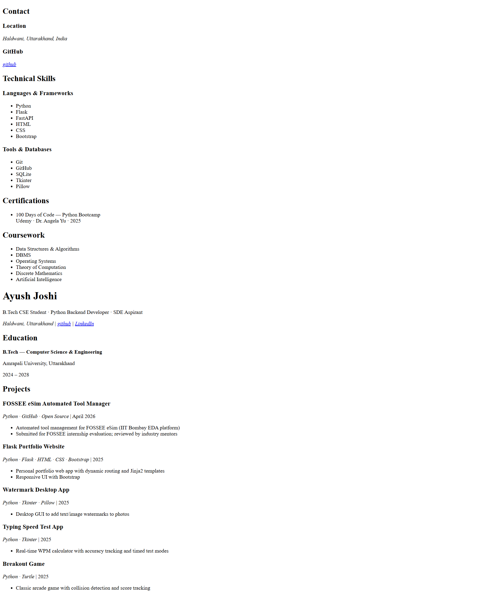

# Ayush Joshi — Resume (HTML)

A personal resume built using **semantic HTML5 only**.
The project follows a clean semantic structure and is designed to be styled later using CSS with a two-column layout consisting of **`<aside>`** and **`<main>`**.

---

## Project Structure

```text
.
├── resume.html
├── style.css
├── README.md
└── RESUMEHTML.png
```

---

## HTML Structure

```text
html
│
├── head
│   ├── meta (charset)
│   ├── meta (viewport)
│   ├── meta (description)
│   ├── meta (author)
│   ├── title
│   └── link (style.css)
│
└── body
    │
    └── article
        │
        ├── section (.Resume-container)
        │   │
        │   ├── aside
        │   │   │
        │   │   ├── section (Contact)
        │   │   │   ├── h2
        │   │   │   ├── hr
        │   │   │   ├── section (Location)
        │   │   │   ├── section (GitHub)
        │   │   │   └── section (LinkedIn)
        │   │   │
        │   │   ├── section (Technical Skills)
        │   │   │   ├── section (Languages & Frameworks)
        │   │   │   └── section (Tools & Databases)
        │   │   │
        │   │   ├── section (Certifications)
        │   │   │   └── article
        │   │   │       ├── header
        │   │   │       ├── p
        │   │   │       └── time
        │   │   │
        │   │   └── section (Coursework)
        │   │       └── ul
        │   │
        │   └── main
        │       │
        │       ├── header
        │       │   ├── h1
        │       │   ├── Professional Title
        │       │   └── Contact Links
        │       │
        │       ├── section (Education)
        │       │   └── article
        │       │       ├── header
        │       │       ├── p
        │       │       └── time
        │       │
        │       ├── section (Experience)
        │       │   └── article
        │       │       ├── header
        │       │       ├── strong
        │       │       ├── time
        │       │       └── ul
        │       │
        │       └── section (Projects)
        │           ├── article (FOSSEE eSim Automated Tool Manager)
        │           ├── article (Flask Portfolio Website)
        │           ├── article (Watermark Desktop App)
        │           ├── article (Typing Speed Test App)
        │           └── article (Breakout Game)
        │
        └── footer
            └── Copyright
```

---

## Semantic HTML Elements Used

| Tag             | Purpose                                                          |
| --------------- | ---------------------------------------------------------------- |
| `<article>`     | Represents the entire resume and individual resume entries       |
| `<header>`      | Header of the resume and each article                            |
| `<main>`        | Main content area containing education, experience, and projects |
| `<aside>`       | Sidebar containing supporting information                        |
| `<section>`     | Groups related content into logical sections                     |
| `<footer>`      | Footer containing copyright information                          |
| `<address>`     | Contact information (GitHub and LinkedIn)                        |
| `<time>`        | Represents dates with the `datetime` attribute                   |
| `<strong>`      | Highlights important text such as organization names             |
| `<ul>` / `<li>` | Lists for skills, coursework, and achievements                   |
| `<hr>`          | Separates section headings visually                              |

---

## Features

* Semantic HTML5 structure
* Two-column resume layout
* Organized content using semantic elements
* Proper use of `<time>` and `<address>`
* Accessible and SEO-friendly markup
* Ready for CSS styling
* No JavaScript required

---

## How to Run

1. Clone or download this repository.
2. Open **`resume.html`** in any modern web browser.

No installation, dependencies, or build tools are required.

---

## Screenshot



---

## Author

**Ayush Joshi**

* B.Tech Computer Science & Engineering
* Amrapali University, Uttarakhand
* Python Backend Developer
* SDE Aspirant

**GitHub:** https://github.com/AyushThinks

**LinkedIn:** https://www.linkedin.com/in/ayush-joshi-4a4316367/